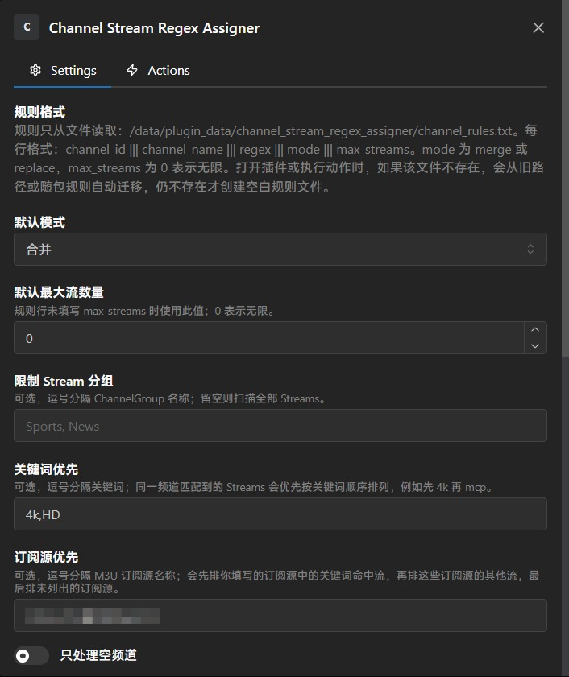
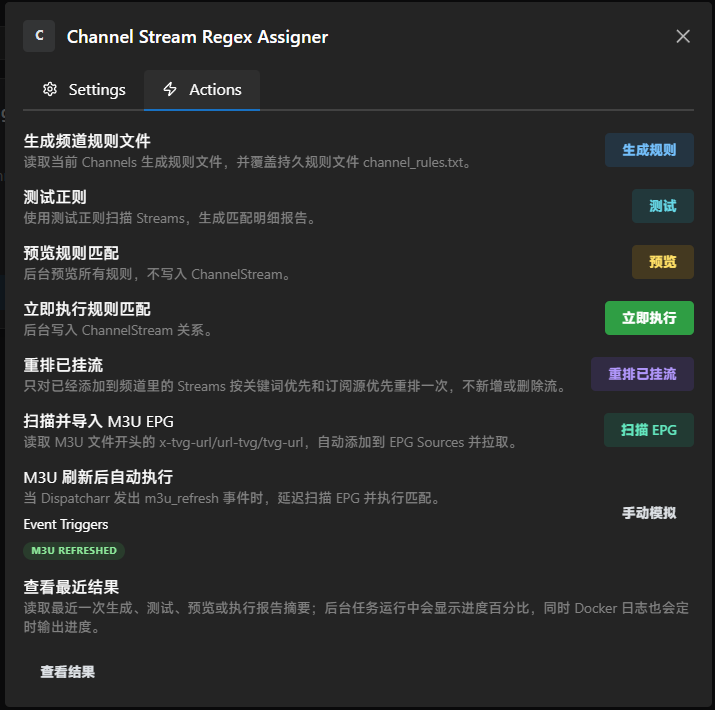

# Channel Stream Regex Assigner

Dispatcharr 插件：按正则规则把现有 Streams 自动挂到现有 Channels，按照规则排序频道里面的流，获取订阅中的EPG放到程序中订阅，等方便程序使用的功能




## 安装

1. 将 `channel_stream_regex_assigner.zip` 上传到 Dispatcharr 的 Plugins 页面。
2. 启用插件。

## 推荐流程

1. 点击 `生成规则`。(我里面放了一份简单的，可以自己添加或者直接通过生成规则覆盖掉)
2. 直接编辑 `/data/plugin_data/channel_stream_regex_assigner/channel_rules.txt`。
3. 可先填写 `测试正则` 并点击 `测试` 查看单条正则匹配数量。也可以`预览规则匹配`来看整个规则最终的匹配流
4. 确认报告无误后点击 `立即执行`。
5. 后台任务运行时，可反复点击 `查看结果` 查看当前任务、任务 ID 和百分比进度，也可以在 Docker 日志里看到定时进度输出；完成后到插件目录 `exports/` 查看 txt 报告。
6. 已有长任务处于等待或运行中时，新的预览、执行、重排、EPG 扫描和自动刷新任务会被拦截，避免多个任务互相覆盖。

## 匹配结果排序

插件会在写入频道前，对同一条规则匹配到的 Streams 做可选排序：

- `关键词优先`：逗号分隔，例如 `4k,mcp`。Stream 名称包含 `4k` 的排前面，其次是包含 `mcp` 的，最后是其他流。
- `订阅源优先`：逗号分隔 M3U 订阅源名称，例如 `Source-A,Source-B`。同时填写关键词时，排序为：`Source-A` 里的 `4k/mcp`、`Source-B` 里的 `4k/mcp`、`Source-A` 其他流、`Source-B` 其他流、最后其他订阅源的流。
- 同一优先级内部按订阅源名称、Stream 名称和 ID 稳定排序。
- `移除已失效挂流`：默认开启。执行规则匹配或重排已挂流时，会自动删掉频道里已经失效的 Stream。

如果 Streams 已经添加到频道里，点击 `重排已挂流` 可以更新现有挂流顺序一次；默认还会删除已失效挂流，关闭 `移除已失效挂流` 后则只改顺序。有规则文件时只处理规则里的频道；规则文件为空时处理全部已有挂流频道。

## 自动执行

插件只在 Dispatcharr 发出 `m3u_refresh` 事件后自动执行，不做固定间隔轮询。
如果同一时间段内连续收到多个 `m3u_refresh`，插件会把它们合并到当前自动任务里，等当前匹配结束后自动补跑一次，避免刷新和匹配互相打断。

> 前置条件：M3U 刷新自动触发依赖 Dispatcharr 宿主侧的「插件事件派发」能力（action 上的 `events: ["m3u_refresh"]` 字段）。该能力是较新版本才加入的，且官方 `Plugins.md` 尚未文档化。若你的 Dispatcharr 版本过旧、插件未启用、或升级插件后未 reload，自动触发都不会生效——此时可改用「每日定时执行」作为兜底。

1. 打开 `M3U 刷新后自动执行`。
2. 设置 `M3U 刷新后延迟分钟`。
3. M3U 刷新成功后，插件会延迟排队执行匹配。
4. 需要立刻跑时，点击 `立即执行`。
5. 自动任务运行、合并、被阻塞和补跑都会写入后台日志与最近结果，方便排查凌晨刷新是否被挤掉。

排查自动触发是否真的到达插件：在 Docker 日志里搜索 `channel_stream_regex_assigner run() 被调用`。
- 手动点任意按钮会看到 `来源=手动触发(UI按钮)`，说明日志通道正常。
- 真实 M3U 刷新后应出现 `action=auto_m3u_refresh 来源=自动触发(事件=m3u_refresh)`；若始终没有这行，说明事件没派发到插件，按上面「前置条件」三项排查（最常见是 Dispatcharr 版本过旧）。

## 每日定时执行

如果不想只依赖 M3U 刷新事件，也可以开启每日定时执行。定时器使用 Docker 容器本地时间，不做额外时区换算。

1. 打开 `启用每日定时执行`。
2. 填写 `每日执行时间`，格式如 `04:30`。
3. 点击 `启动定时`。修改时间后也需要再点一次 `启动定时` 刷新定时器。
4. 需要关闭时点击 `停止定时`。

每日定时任务会启动一次完整规则匹配。匹配开始后会沿用插件后台任务互斥保护，其它预览、立即执行、重排、自动 M3U 刷新任务不能打断它；如果到点时已有其它任务正在运行，本次定时会记录为被阻塞，不会强行插队。

这个定时器运行在 Dispatcharr 插件所在的 Python 进程内。如果 Docker 容器、Dispatcharr 服务或插件进程重启，正在运行的线程会停止；重启后请打开插件并点击一次 `启动定时`。

## 停止与解锁

如果页面提示已有后台任务正在执行，但你确认任务已经卡住，点击 `停止全部`：

- 会停止每日定时器。
- 会请求当前后台任务协作取消，并把当前阻塞状态标记为 `canceled`。
- 会解除旧任务对后续预览、执行、重排、EPG 扫描和自动刷新的阻塞。

Python 线程不能被安全硬杀，所以取消会在插件自己的进度点生效，例如规则之间、Streams 扫描进度回调、EPG 账号扫描之间。如果线程已经卡在外部数据库或文件 IO 调用里，按钮会先清掉插件状态锁，让新任务不再被旧状态挡住。

插件还会记录当前进程 ID。Docker 或 Dispatcharr 重启后，旧进程留下的 `running/waiting` 状态不会再阻塞新任务。

安装或更新插件后，如果页面仍显示旧版本，请在 Plugins 页面点一次 reload，或禁用再启用本插件。

## M3U 头部 EPG 自动导入

打开 `自动导入 M3U 头部 EPG` 后，插件会读取 M3U 文件开头一点点内容，识别这些写法：

```text
#EXTM3U x-tvg-url="https://example.com/epg.xml.gz"
#EXTM3U url-tvg="https://example.com/epg.xml"
#EXTM3U tvg-url="https://example.com/xmltv.php"
```

插件只看文件开头，遇到第一个 `#EXTINF` 会停止，所以不会读取整个大文件；如果开头没有写 EPG 地址，就直接跳过。找到 EPG URL 后：

- 如果 EPG Sources 里已有相同 URL，会复用现有源。
- 如果没有，会创建 `Auto EPG - <M3U账号名>`。
- 新建源会由 Dispatcharr 自动拉取一次。
- 复用已有源时，如果打开 `导入后拉取 EPG`，会再排队刷新一次。

手动点击 `扫描 EPG` 会扫描全部启用的 M3U 账号；M3U 刷新成功事件触发时，会优先扫描本次刷新的账号。

## 规则格式

推荐使用 `|||` 分隔，避免正则里的 `|` 被误拆：

```text
# channel_id ||| channel_name ||| regex ||| mode ||| max_streams
12 ||| CCTV-1 ||| ^CCTV[-_ ]?1($|高清|HD) ||| merge ||| 0
13 ||| CCTV-5 ||| ^CCTV[-_ ]?5($|体育|HD) ||| replace ||| 2
20 ||| 湖南卫视 ||| ^湖南卫视.*$ ||| merge ||| 0
```

- `channel_id`：可选频道 ID，主要用于本机兼容；共享规则时可保留但不会优先使用。
- `channel_name`：优先按频道名称找频道；如果多个频道同名，使用 ID 最小的第一个频道。精确名称找不到时，会兼容 `超清` 后缀，例如 `CCTV10` 可定位到 `CCTV10超清`。
- `regex`：默认匹配 Stream 名称；可在插件设置里改为 URL 或 名称+URL。
- `mode`：`merge` 合并，`replace` 覆盖。
- `max_streams`：最大流数量，`0` 表示无限。

也兼容 Tab 分隔和 `空格 | 空格` 分隔。

规则文件的默认持久路径：

```text
/data/plugin_data/channel_stream_regex_assigner/channel_rules.txt
```

这个路径不在插件安装目录里，升级插件时不会被新 zip 覆盖。打开插件或执行动作时，如果该文件不存在，插件会先从旧路径 `/data/plugins/channel_stream_regex_assigner/exports/channel_rules_template.txt`、旧持久路径 `/data/plugin_data/channel_stream_regex_assigner/channel_rules_template.txt` 或随包 `channel_rules.txt` 自动迁移；仍不存在才创建一份空白规则文件。`生成规则` 会按当前 Channels 覆盖生成规则文件，执行前会要求确认。

## 去重逻辑

- 同一个频道已有相同 `stream_id` 时跳过。
- 合并时，URL 相同也跳过。
- 新匹配结果内部会按 `stream_id` 和 URL 去重。
- `replace` 规则没有匹配结果时，默认不会清空频道；需要打开 `允许空匹配覆盖清空频道`。
- 执行规则匹配和重排已挂流时，默认会先移除频道里已经失效的 Stream；如需保留，可关闭对应勾选。
